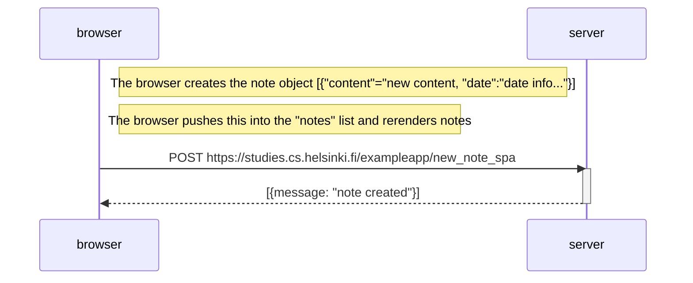

```mermaid
    sequenceDiagram
        participant browser
        participant server
        
        Note right of browser: The browser creates the note object [{"content"="new content, "date":"date info..."}] 
        Note right of browser: The browser pushes this into the "notes" list and rerenders notes

        browser->>server: POST https://studies.cs.helsinki.fi/exampleapp/new_note_spa 
        activate server 
        server-->>browser: [{message: "note created"}]
        deactivate server
```
